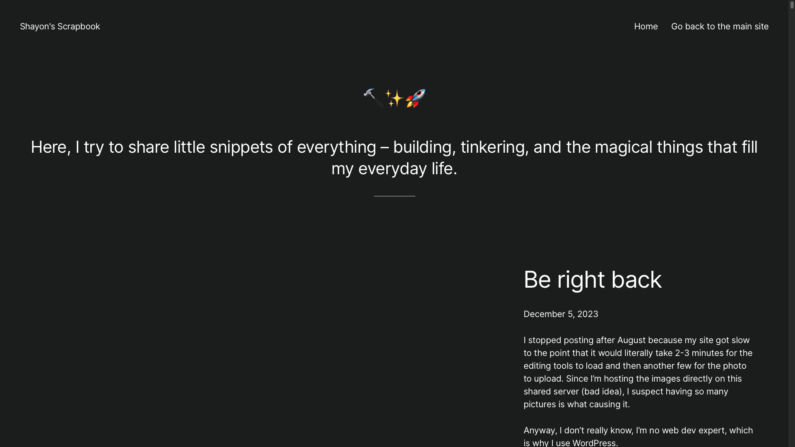

+++
date = "2024-05-01"
title = "About"
+++

I made my first Scrapbook website back in February, 2023 

The idea was to take pictures every day, and post them on an online scrapbook along with a small description of what I did that day. It was inspired by the [the Hack Club Scrapbook](https://scrapbook.hackclub.com), which I found pretty cool. They also had a streak system that I added in V0 - my first iteration of the scrapbook. However, in V1, I decided to leave that part out. I guess I don't really like the concept of streaks anymore.

Anyway, yeah, that was it, in a nutshell. This is a place where I post my everyday life stuff.


This was my first scrapbook, the V0. Something I put together quickly to start. I made it with WordPress and installed it on a subdomain of my main website.

It ran fine for a few months. Then I stopped scrapbooking in December. Here's why.

## Entry  from December 5, 2023, "Be right back"

```
I stopped posting after August because my site got slow to the point that it would literally take 2-3 minutes for the editing tools to load and then another few for the photo to upload. Since I’m hosting the images directly on this shared server (bad idea), I suspect having so many pictures is what causing it.
Anyway, I don’t really know, I’m no web dev expert, which is why I use WordPress.
I’ll look into moving my scrapbook somewhere else, or at least offload the thumbnails of the posts elsewhere. Since I usually post a week or two’s worth of scrapbook content at a time, having a 2-3 minutes delay between each really kills the flow.
So, for now, I’m taking a break. The academic pressure’s been crazy lately too.
```
    
And then I never really got back to it - even though I meant to. Things were busy; new stuff kept coming and coming. Had no energy to look into making a lighter scrapbook.

Until May 1, 2024 happened. I don't know if it was just me being bored or the first-day-of-month energy. But I randomly came across Hugo, spent the whole day setting up a static site, importing the old posts from V0 and... bam, here I am. With a shiny new V1 in my hand. 

Let's see how it goes this time.